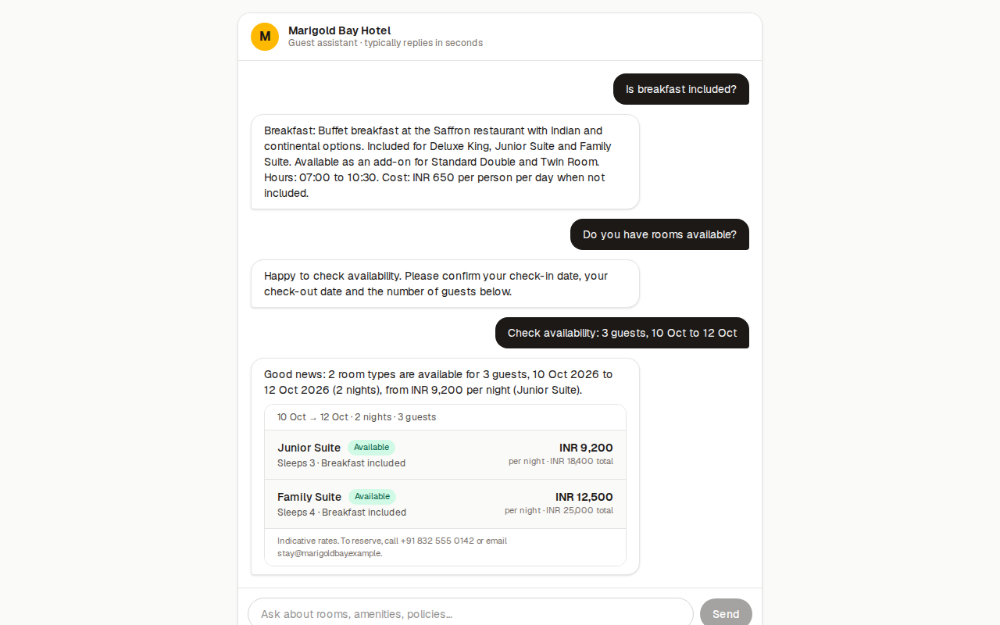
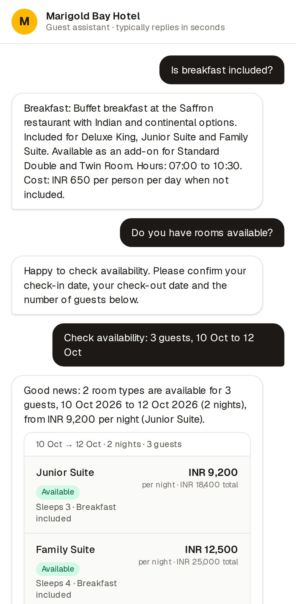

# Marigold Bay Hotel — AI Guest Assistant

A small full-stack app: a chat interface where hotel guests ask about the property and check room availability. The frontend is Next.js; the backend is a set of Next.js route handlers that ground a Gemini model in a JSON knowledge base and call a deterministic availability tool.

**Live demo:** _URL added after deploy_ · **Docs:** [Architecture](#architecture) · [API examples](docs/api-examples.md) · [Decisions](docs/decisions.md) · [Evaluation](docs/evaluation.md) · [AI tools used](docs/ai-tools-used.md)

## Quick start

```bash
git clone https://github.com/Ayuszz/hotel-guest-assistant.git
cd hotel-guest-assistant
npm install
cp .env.example .env          # add your GEMINI_API_KEY (free tier works)
npm run dev                   # http://localhost:3000
```

No key? Leave `GEMINI_API_KEY` unset (or set `LLM_PROVIDER=mock`) and the app runs fully offline with a deterministic mock model. Every test uses that mock, so the suite needs no network or key.

```bash
npm test          # 43 unit + integration tests (vitest)
npm run test:e2e  # Playwright: full browser flow, desktop + mobile (builds the app first)
npm run typecheck
npm run lint
```

Node 20+ is required. Get a free Gemini key at https://aistudio.google.com/apikey.

## Screenshots

| Desktop | Mobile |
| --- | --- |
|  |  |

## What it does

- Answers property, room, amenity, policy and FAQ questions from `data/hotel.json`, and only from there.
- Detects availability intent, collects check-in, check-out and guest count with an in-chat form, and runs `checkAvailability(checkIn, checkOut, adults)` over `data/inventory.json`.
- Keeps conversation context so follow-ups like "how much is it?" resolve.
- Returns a fixed fallback with the front-desk contact whenever the answer is not in the data.
- Shows loading, error and retry states; works on phone and desktop.

## Architecture

```
Browser (Next.js, React 19)                  Server (Next.js route handlers, Node runtime)
┌──────────────────────────┐   POST /api/chat   ┌──────────────────────────────────────────┐
│ Chat.tsx                 │ ─────────────────▶ │ route.ts  ── JSON + Zod validation        │
│  · message list          │                    │ chat.ts   ── orchestration                │
│  · loading / error / retry│                   │   1. classify intent + slots ─▶ LLM        │
│  · AvailabilityForm      │                    │   2a. availability ─▶ checkAvailability()  │
│  · AvailabilityCard      │ ◀───────────────── │   2b. knowledge ─▶ retrieve() ─▶ LLM answer│
│ lib/api.ts (only caller) │  typed envelope    │   3. hallucination guard, fallback rules   │
└──────────────────────────┘                    │ knowledge.ts  · availability.ts            │
                                                │ llm/gemini.ts · llm/mock.ts · conversation │
                                                └──────────────────────────────────────────┘
                                                   data/hotel.json      data/inventory.json
```

**Data flow for a question.** The browser posts the message, a conversation id and the last 10 turns. The server asks the model one JSON question: intent, any dates or guest count it can extract, and topic keywords. Knowledge questions then go through keyword retrieval over the JSON, and the model is asked to answer *only* from the retrieved sections, returning `grounded: false` if it cannot. Any number in the answer that is not present in the retrieved text rejects the answer. Availability requests never reach the model for the answer: the tool runs in code and the reply text is templated.

**Where AI is used:** understanding the question, extracting dates and counts, phrasing the grounded answer.
**Where it is not:** retrieval, date validation, capacity filtering, pricing, availability, response shape, fallbacks.

**Response envelope** (`type` drives rendering):

| type | when | extra fields |
| --- | --- | --- |
| `text` | grounded knowledge answer | `sources[]` |
| `availability` | tool ran | `data` (nights, rooms with price and stock) |
| `clarification` | dates or guests missing or invalid | `needs[]`, `known` |
| `fallback` | not in data, out of scope, or model unavailable | `reason` |
| `error` | bad request or server fault (4xx/5xx) | `code` |

**Deployment.** One Vercel project (Hobby tier) hosts UI and API. The only secret, `GEMINI_API_KEY`, lives in Vercel env vars and is read server-side. Conversation history is carried by the client because serverless instances do not share memory; the in-memory store is an optimisation, not a dependency.

## Project layout

```
data/            hotel.json (knowledge base), inventory.json (mock stock + bookings)
src/app/         page.tsx, layout.tsx, api/chat, api/health
src/components/  Chat, AvailabilityForm, AvailabilityCard, TypingIndicator
src/lib/api.ts   the single frontend → backend client
src/server/      chat.ts (orchestration), availability.ts (tool), knowledge.ts (retrieval),
                 conversation.ts, logger.ts, types.ts, llm/{provider,prompts,gemini,mock,index}.ts
tests/           vitest: availability, knowledge, chat (mocked LLM), Chat UI
e2e/             Playwright browser flow
docs/            api-examples, decisions, evaluation, ai-tools-used
```

## Environment variables

| name | default | purpose |
| --- | --- | --- |
| `GEMINI_API_KEY` | — | Gemini key. Unset → mock provider |
| `GEMINI_MODEL` | `gemini-2.5-flash` | model id |
| `LLM_PROVIDER` | `gemini` if key set, else `mock` | force `mock` for offline runs |
| `LLM_TIMEOUT_MS` | `15000` | per-call timeout before fallback |

## Deploying to Vercel (free)

1. Push this repo to GitHub.
2. vercel.com → Add New Project → import the repo → keep Next.js defaults.
3. Environment Variables → add `GEMINI_API_KEY`. Deploy.
4. Open the URL, ask "Is breakfast included?".
